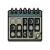
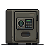
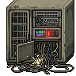

# 


> Live homelab dashboard. Solar, battery, cameras, weather, security, services, agent chat.  
> Dark cyberpunk aesthetic. Single Python file. No build step. No cloud. Just vibes.

---

##  What's on it

| | |
|---|---|
|  | **COMMAND** — CPU, RAM, disk, swap with 60-point sparkline charts |
|  | **ATMOS** — temp, wind, rain, fire danger rating (NSW RFS), Hawkesbury River level |
|  | **POWER** — FoxESS inverter live from LAN dongle (no cloud). Solar, home load, grid import/export, battery SOC with animated history chart |
|  | **OPSEC** — SSH hardening, fail2ban jails, WireGuard peers with country flags, Tailscale status |
|  | **OVERWATCH** — NVR camera detections with confidence %, live cam snapshot |
|  | **COMMS** — last 3 messages between homelab agents (Hermes, Clawd, etc.) |
|  | **BAMBU P1S** — printer temps, print progress, filament type, error count |
|  | **SIGINT** — Flipper Zero, Baofeng scanner, RTL-SDR, radio chatter DB |
|  | **BIO-SCAN** — BirdNET detections last hour |
|  | **INTEL** — 8 latest ABC News RSS headlines |
|  | **LOG** — recent system events from sentience DB |
|  | **CONTAINERS** — Docker containers and systemd services, running or dead |

---

##  Prerequisites

### System
- **OS:** Linux (tested on Debian Trixie)
- **Python:** 3.11+
- **User with sudo** for `wg show` (WireGuard VPN status)
- **Docker** accessible without sudo (or add user to `docker` group)
- **MQTT broker** (EMQX, Mosquitto, etc.) with `homelab/#` topic namespace
- **systemctl --user** available for user service checks

### Services (all on localhost unless noted)
- **Frigate NVR** on port 5000
- **Agent Chat Bus** (SQLite DB, default at `~/agent-chat-web/chat.db`)
- **BirdNET** (SQLite DB at `~/.sentience/sentience.db`)
- **FoxESS dongle** accessible on LAN (solar data polled directly, no cloud)
- **Bambu P1S** on LAN (MQTT, port 8883)
- **NetAlertX** or equivalent MQTT publisher for network devices
- **WireGuard** (`sudo wg show` — passwordless sudo required for VPN status)

### Python Packages

```bash
pip install fastapi uvicorn paho-mqtt psutil requests
```

| Package | Why |
|---------|-----|
| `fastapi` | Web framework |
| `uvicorn` | ASGI server |
| `paho-mqtt` | MQTT client (sensor data) |
| `psutil` | CPU/RAM/disk metrics |
| `requests` | Frigate API calls |

### Filesystem
The dashboard reads from these paths — create symlinks or adjust in `dashboard.py`:
- `~/.sentience/sentience.db` — BirdNET + system journal (or your equivalent)
- `~/agent-chat-web/chat.db` — agent bus messages (optional)
- `~/rig-dashboard/fox_history.json` — solar history ring buffer
- `~/rig-dashboard/sparkline_history.json` — CPU/RAM/disk history
- `~/rig-dashboard/icons/` — pixel GIF icons (included in repo)
- Paths for FoxESS cache, river level, Tailscale peers can be configured in `dashboard.py`

### Network
- **Port 8701** open on LAN (or exposed via Tailscale)
- MQTT broker at your broker IP:1883 (set `MQTT_BROKER` env var or edit dashboard.py)
- FoxESS dongle accessible on LAN (polled via a separate cron job, not directly from dashboard)
- Frigate API at `localhost:5000`

###  Optional (cards hide gracefully if unavailable)
- Flipper Zero (MQTT topic `homelab/flipper`)
- RTL-SDR radio scanner (MQTT topic `homelab/radio`)
- WireGuard (`sudo wg show` — requires passwordless sudo)
- systemctl user services (checked via `systemctl --user is-active`)

---

##  Install

```bash
# Clone
git clone https://github.com/defthrets/rig-dashboard.git
cd rig-dashboard

# Create venv (recommended)
python3 -m venv venv
source venv/bin/activate

# Install deps
pip install fastapi uvicorn paho-mqtt psutil requests

# Set env vars for your setup:
export MQTT_BROKER="your.mqtt.broker.ip"
export MQTT_PORT="1883"
```

##  Run

```bash
# Direct
python3 dashboard.py

# Or with systemd user service
mkdir -p ~/.config/systemd/user
cat > ~/.config/systemd/user/sprawl-dashboard.service << 'EOF'
[Unit]
Description=The Sprawl Dashboard
After=network-online.target

[Service]
Type=simple
WorkingDirectory=%h/rig-dashboard
ExecStart=%h/rig-dashboard/venv/bin/python3 dashboard.py
Environment=MQTT_BROKER=192.168.1.253
Environment=MQTT_PORT=1883
Restart=always
RestartSec=5

[Install]
WantedBy=default.target
EOF

systemctl --user daemon-reload
systemctl --user enable --now sprawl-dashboard
```

Dashboard at **`http://your-server:8701`**  
API at **`http://your-server:8701/api/data`**

### Expose via Tailscale

```bash
tailscale serve --bg --https=8443 http://127.0.0.1:8701
# → https://your-hostname.tailxxxxx.ts.net:8443
```

---

##  How it works

| # | What happens |
|---|-------------|
| 1 | **MQTT listener** connects to local broker on startup, subscribes to `homelab/#`, caches everything in memory |
| 2 | **FoxESS** data fed by a separate cron job (`foxess_poll.py` every 15min) → `foxess_cache.json` |
| 3 | **On page load** — fetches Frigate events, reads SQLite DBs, runs `sudo wg show`, queries Docker + systemd |
| 4 | **Frontend** — single HTML/CSS/JS file served inline. Polls `/api/data` every 10s. No React. No webpack. No 47MB of `node_modules` |
| 5 | **Sparklines** — 60-point ring buffers for CPU/RAM/disk, seeded from disk, updated in-browser each poll |
| 6 | **Power chart** — 90-point solar history from `fox_history.json`, solar/home/grid as overlapping lines |

---

##  Security

> 🔐 LAN only by default — not exposed to the internet  
> 🔐 Tailscale serve for remote access (tailnet only, not funneled)  
> 🔐 Needs passwordless sudo for `wg show` only  
> 🔐 No auth on dashboard — it's internal  
> 🔐 Solar data from LAN dongle, not FoxESS Cloud — no API key, no data leaving the house  

---

##  Responsive

| Viewport | Layout |
|----------|--------|
| **Desktop** (>900px) | Multi-column auto-fill grid, triple-row stays 3-column |
| **Tablet** (600–899px) | 2-column layout |
| **Mobile** (<600px) | Single column, compact headers |
